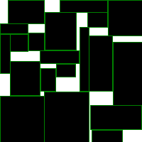

# Rectangles

Простенький алгоритм для оптимизации расположения прямоугольников (минимизируем площадь пересечения)

## Идея
Давайте заставим каждый прямоугольник подвинуться туда, куда его "спихивают" с силой пропорциональной площади пересечения с прямоугольником, который спихивает.
Посчитаем это для всем пар прямоугольников и получим итеративное улучшение ситуации.
